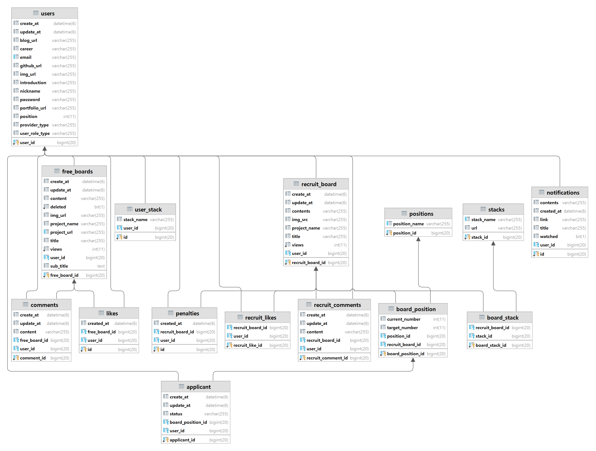

<div style="display: flex;justify-content: center"></div>

<h3>열정을 함께할 동료가 필요할 때, 사이드 이펙트</h3>
<p>개발자, 디자이너 등 누구나 쉽게 프로젝트를 시작하고, 네트워킹할 수 있는 커뮤니티 플랫폼입니다</p>

***AWS 프리티어 만료로 현재는 운영하지 않습니다!!***

[팀 소개](https://github.com/Side-Effect-Team)

[프론트 레포](https://github.com/Side-Effect-Team/side-effect-frontend)

<br>

---

## 💻 페이지 소개

<table>
	<tbody>
		<tr>
			<th>랜딩 페이지</th>
			<th>다크모드 기능</th>
		</tr>
		<tr>
			<td></td>
			<td></td>
		</tr>		
		<tr>
			<td>- 모든 페이지에서 반응형 UI 지원<br>- 해당 서비스의 특징 및 사용법 안내<br>- 실시간 인기게시글 확인</td>
			<td>- 모든 페이지에서 다크모드 지원</td>
		</tr>	
		<tr>
			<th>로그인 페이지</th>
			<th>회원가입 하기</th>
		</tr>
		<tr>
		<td></td>
			<td></td>
		</tr>
		<tr>
			<td>- 로그인 반응형 모달<br>- 소셜 로그인 기능</td>
			<td>- 회원가입 기능<br>-  기능</td>
		</tr>
		<tr>
			<th>마이 페이지</th>
			<th>프로필 변경하기</th>
		</tr>
		<tr>
			<td></td>
			<td></td>
		</tr>
		<tr>
			<td>- 개인 프로필 관리<br>- 관심 게시글 및 작성 게시물 모아보기<br>- 지원 현황 및 상태 확인<br>- 계정 탈퇴 기능</td>
			<td>- 아바타 이미지 변경 기능<br>- 본인을 나타내는 해시태그<br>- 포지션, 경력 등의 정보 추가 및 수정 기능</td>
		</tr>
		<tr>
			<th>프로젝트 자랑 게시글 작성하기</th>
			<th>팀원 모집 게시글 상세 페이지</th>
		</tr>
		<tr>
			<td></td>
			<td></td>
		</tr>
		<tr>
			<td>- 잘못된 데이터 입력을 에러 메시지로 경고<br>- 프로젝트 대표이미지 등록 가능</td>
			<td>- 모집중인 포지션에 지원 가능<br>- 게시글 작성자인 경우 수정/삭제 가능<br>- 댓글 등록 및 수정, 삭제 가능</td>
		</tr>
		<tr>
			<th>팀원 모집 게시판 페이지</th>
			<th>팀원 모집 게시글 작성하기</th>
		</tr>
		<tr>
			<td></td>
			<td></td>
		</tr>
		<tr>
			<td>- 게시글을 무한 스크롤 형태로 빠르게 로딩<br>- 원하는 기술 태그 또는 내용의 게시글 검색</td>
			<td>- 팀원 모집 게시글 작성 기능<br>- 모집할 포지션 설정 및 기술 태그 검색 후 추가</td>
		</tr>
				<tr>
			<th>알람 이벤트</th>
			<th>게시물 관심목록 추가</th>
		</tr>
		<tr>
			<td></td>
			<td></td>
		</tr>
		<tr>
			<td>- 댓글 발생 알람 기능<br>- 모집 게시판 참여자 발생 알람 기능</td>
			<td>- 마이페이지 관심 목록 추가 기능</td>
		</tr>
		<tr>
			<th>팀 관리 모달</th>
			<th>스켈레톤 컴포넌트</th>
		</tr>
		<tr>
			<td></td>
			<td></td>
    	<tr>
    	<tr>
    		<td>- 지원자 관리 및 팀원 관리 반응형 모달</td>
			<td>- 레이아웃 시프트 방지를 위한 스켈레톤 컴포넌트</td>
    	</tr>
    </tbody>

</table>

</br>

## 🛠️ 기술 스택

<div>


</div>
<br>


## 🌳 폴더 구조

```
src─|
    java
    ├─common : Exception관련 파일이나 공통 클레스(aop, validation, converter, image upload) 파일로 구성
    ├─config : 각종 설정파일 구성
    ├─controller : 컨트롤러 파일 보관
    ├─domain
    │  ├─[domain name] : 각 도메인마다 엔티티파일과 연관 enum 파일로 구성
    ├─dto
    │  ├─[domain name] : 각 도메인의 dto 파일 보관
    ├─redis : redis 레파지토리 파일 보관
    ├─repository : 레파지토리 파일 보관
    ├─security : spring security 파일 구성
    ├─service : 서비스 파일 보관
    resources
    ├─mail-templates : 알림 메일 템플릿 파일 보관

test─|
    java
    ├─common
    │  ├─docs : Rest Docs 관련 유틸파일과 공통 클래스
    │  ├─jpa : jpa(query dsl) 테스트 관련 설정
    │  ├─securty : custom mock user 관련 파일
    ├─controller : 컨트롤러 테스트 파일 보관
    ├─convertor  : 컨버터 테스트 파일 보관
    ├─dto : dto 테스트 파일 보관
    ├─redis  : redis 레파지토리 테스트 파일 보관
    ├─repository : 레파지토리 테스트 파일 보관
    ├─security : spring security 관련 테스트 파일 보관
    ├─service : 서비스 테스트 파일 보관
```

## 💻 주요 기능

### 모집 게시판

- 사이드 프로젝트나 포트폴리오를 위한 프로젝트 팀원을 구하는 게시판 구현
- 댓글, 추천 기능 구현
- 키워드 및 기술 태그 검색 및 무한 스크롤 기능 구현
- 게시글 모집 포지션 지원 기능 구현
- 지원자 및 팀원 관리 기능 구현
- 지원 취소 기능 구현

### 자랑 게시판

- 만든 프로젝트를 자랑하는 게시판 구현
- 댓글, 추천 기능 구현
- 키워드에 따른 검색 조회 기능 구현
- 댓글수, 조회수, 최신순, 좋아요수에 따른 무한 스크롤 기능 구현
- 이미지 업로드 기능 구현

### 유저

- JWT(Access Token, Refresh Token) 구현
- Spring Security를 통한 보안 설정
- SNS 로그인 구현
- 알림 기능 구현

## 📃 ERD

  <p align = "center">
    
	  


## 부딪힌 기술적 이슈 해결 과정

### QueryDSL 도입을 통한 동적 쿼리 개선 [[관련 포스팅]](https://github.com/sksrpf1126/study/blob/main/%ED%94%84%EB%A1%9C%EC%A0%9D%ED%8A%B8/QueryDSL%EC%9D%84%20%ED%86%B5%ED%95%9C%20%EB%8F%99%EC%A0%81%20%EC%BF%BC%EB%A6%AC%20%EA%B0%9C%EC%84%A0.md)

처음부터 QueryDSL을 도입하지 않고, JPQL과 Spring Data JPA로 개발을 하다 필요성이 느껴질 때 도입함으로써 QueryDSL의 사용 이유를 체감하였습니다.

JPQL로 작성되어 있던 동적 쿼리를 QueryDSL을 통해 리팩토링함으로써, 코드의 가독성과 조인쿼리나 조건에 들어갈 쿼리들을 메서드로 분리함으로써 재사용성을 향상시켰습니다.  
또한, 문자열로 쿼리를 작성하는 JPQL의 문제점을 해결할 수 있었습니다.

### Count VS Exists 쿼리 선택 [[관련 포스팅]](https://github.com/sksrpf1126/study/blob/main/JPA/Count%20%EC%BF%BC%EB%A6%AC%EC%99%80%20Exists%20%EC%BF%BC%EB%A6%AC.md)

Count 쿼리는 조건에 맞는 데이터를 전부 카운팅을 한 뒤에 그 수를 반환하기 때문에 조건에 맞는 데이터의 존재 여부만을 판단할 때 사용한다면 성능 문제가 발생합니다.

이러한 성능 문제를 Exists쿼리나 Limit 1을 통해 조건에 맞는 데이터가 있을 때 바로 반환되게 함으로써 해결하였습니다.

### 좋아요 기능 인덱스 적용 [[관련 포스팅]](https://github.com/sksrpf1126/study/blob/main/%ED%94%84%EB%A1%9C%EC%A0%9D%ED%8A%B8/side-effect%20INDEX%20%EC%A0%81%EC%9A%A9.md)

팀원분의 조언으로 게시글과 사용자의 아이디를 통해 좋아요 여부를 판단하여 토글 방식으로 동작하게 되는 기능에 인덱스를 적용하였습니다.  
게시글 아이디와 사용자의 아이디에 복합 인덱스를 추가하였으며, 150만건의 데이터를 넣어서 테스트를 해보았을 때 약 11 ~ 12배의 성능이 향상된 것을 확인할 수 있었습니다.

### 게시글 조회수 동시성 문제 [[관련 포스팅]](https://github.com/sksrpf1126/study/blob/main/%ED%94%84%EB%A1%9C%EC%A0%9D%ED%8A%B8/%EC%A1%B0%ED%9A%8C%EC%88%98%20%EB%8F%99%EC%8B%9C%EC%84%B1%20%EB%AC%B8%EC%A0%9C.md)

JMeter를 통해 500개의 쓰레드로 동일한 게시글에 대해 조회API를 동시 요청을 하였을 때, 84의 조회수만 증가하였습니다.  
문제를 해결하기 위해 JPA의 비관적 락을 도입하였으며, 정상적으로 500의 조회수 값이 증가가 되는 것을 확인할 수 있었습니다.

### ENUM 대소문자 처리 [[관련 포스팅]](https://github.com/sksrpf1126/study/blob/main/%ED%94%84%EB%A1%9C%EC%A0%9D%ED%8A%B8/ENUM%20%EB%8C%80%EC%86%8C%EB%AC%B8%EC%9E%90%20%EC%B2%98%EB%A6%AC.md)

@RequestParam, @ModelAttribute로 ENUM 타입을 받을 때 타입 컨버터를 커스텀해서 해결하였습니다.

@RequestBody의 경우 ENUM 클래스에 대소문자를 처리하는 전역 메서드를 정의하고 해당 메서드에 @JsonCreator를 적용하였습니다.  
그러면 ENUM 타입에 대해 역직렬화를 할 때 해당 메서드의 로직이 실행이 되기 때문에 @RequestBody에 대해서도 대소문자 구분없이 ENUM값을 처리할 수 있게 되었습니다.

### <u>Spring Security 필터에서 @ExceptionHandler 적용 [[관련 포스팅]](https://github.com/sksrpf1126/study/blob/main/%ED%94%84%EB%A1%9C%EC%A0%9D%ED%8A%B8/Side%20Effect%20%ED%94%84%EB%A1%9C%EC%A0%9D%ED%8A%B8%20%ED%95%84%ED%84%B0%20%EC%98%88%EC%99%B8%20%EC%B2%98%EB%A6%AC.md)</u>

기존 방식은 Spring Security의 커스텀한 필터들에서 예외가 발생하면 해당 예외를 따로 처리하는 필터를 정의하여 해당 필터에서 예외마다 적절한 응답을 보내주었습니다.

변경된 방식은 필터에서 발생한 예외 또한 @RestControllerAdvice의 @ExceptionHandler를 통해 예외를 처리하도록 하여 분리되었던 예외 처리를 하나의 클래스에 집중시키도록 하였습니다.

### **_AWS EC2 스왑 메모리와 Jenkins를 통한 자동 배포_**

기존에는 AWS EC2에 접속하여 수동으로 배포를 하였습니다.  
또한, Free Tier라서 RAM 공간이 1GB였으며, 주기적으로 서버가 멈추는 현상이 발생하였습니다.

그래서 "스왑 메모리"를 설정함으로써 서버가 멈추는 현상을 해결하였으며, 수동으로 배포함에 있어 불편함을 겪던 문제를 팀원분들과 함께 Jenkins를 도입하여 Github의 dev 브랜치에 push하면 자동으로 배포되게 하였습니다.

</br>

## 주간 회고

<details>
	<summary>1주차</summary>

### 📖Learned
1. 클린 코드
	 -> 클린 코드에 무지했었고, 그래서 하나의 메서드가 하나가 아닌 여러 기능(책임)을 처리하게
	 되었습니다. 이를 민수님께서 피드백을 주셨고, 각각의 기능마다 하나의 메서드로 분리하여
	 하나의 메서드가 하나의 기능(책임)을 가지도록 리팩토링 했습니다.


2. Mockito 라이브러리 사용
			-> 제대로 된 프로젝트의 경험이 전무하였기에, 테스트 코드 또한 강의에서 배운 방식밖에 몰랐습니다.
			그래서 이름만 알고 있던 Mockito 라이브러리를 처음 접했고, 사용법에 미숙했기에 팀원분의 코드나
			다른 분들의 테스트 코드를 참고하거나 여러 글들을 참고하여 얕게나마 사용할 수 있게 되었습니다.


3. 2개 이상의 @OneToMany 자식을 가지는 엔티티인 경우 예외 발생
	 -> 모집 게시판의 경우 2개 이상의 @OneToMnay 자식을 가지고 있습니다. 그래서 모집 게시판을 조회할
	 때 각각의 자식들까지 쿼리가 발생하게 되어서 이를 해결하기 위해 fetch join으로 시도를 했습니다.
	 하지만 예외가 발생하였고, 찾아본 결과 2개 이상의 @OneToMany 자식을 대상으로 fetch join을 사용
	 할 시에 예외가 발생한다고 합니다.
	 그래서 default_batch_fetch_size 속성을 통해 해당 문제를 해결했습니다.

</details>
<br />
<details>
	<summary>2주차</summary>

### 📖Learned
- 값의 여부를 확인하기 위해 쿼리를 고민하던 중 COUNT쿼리와 Exists쿼리의 성능 차이가 존재함
을 알았으며, 프로젝트에서 Exists방식으로 쿼리를 구현하려고 하였지만 JPQL에서는 SELECT
EXISTS쿼리가 불가능하며, 값(데이터)의 여부를 판단하기 위해서는 COUNT쿼리를 사용해야
한다고 한다.

- Spring Data JPA에서는 메서드 명으로 ExsistsBy를 통해 값의 여부를 판단할 수 있다고 하지만
실제 쿼리를 보면 Exists가 아닌 limit 1 쿼리를 내부적으로 사용하여 최적화 한다고 한다.
그런데 이 둘의 성능 차이는 거의 동등하다고 한다. 역시 "백문이 불여일타"라고, 프로젝트로
JPA를 사용하면서, 강의로 보고 공부한 내용이랑 직접 사용해보면서 공부하는 거랑은 많은
차이가 존재함을 느꼈다.

### 😊Liked
- 혼자 개발 공부를 했을 때에는 나아가는 방향이 잘못된 방향임에도 불구하고 이를 알지 못하였
	지만 협업을 하며, 코드리뷰를 통해 나의 잘못된 방향이나 부족한 부분을 잡아주신 덕분에
	개발자로써의 좋은 역량을 쌓아가는 것 같다.

### 😓Lacked
- 배포를 해본 경험이 없고, 리눅스나 EC2를 제대로 사용해본 적이 없어 관련 명령어를 잘 알지
	못했다.
- SQL 쿼리에 대한 기본적인 지식이 많이 부족하다 보니, 이를 JPQL 방식의 쿼리를 작성하는 부분에서 섣불리 작성하지 못하는 것 같다.

### 🚀Longed for
- 따로 시간을 잡아 간단하게 나마 배포 연습을 해봐야 겠으며, 쿼리 부분의 기본기를 다시 공부
	해야 겠다.

</details>
<br />
<details>
	<summary>3주차</summary>

### 📖Learned
- enum 타입으로 요청값을 받기 위해서는 기본적으로 대문자나, 숫자(enum타입의 순서)로 값을
	받아야지만 Bad Request를 반환하지 않는다.

- 하지만 요청에서 소문자로도 해당 enum타입 값과 매핑될 수 있게 구현해야 하는 이슈가 생겼다.  
	그래서 여러 글들을 찾아보고 공부하여 @RequestParam 형식이나 @ModelAtrribute를 통해
	받는 enum값은 컨버터를 통해서 요청한 값과 enum값을 비교해서 반환하도록 구현하였으며,
	@RequestBody의 JSON 형식으로 값을 요청할 때에는 HttpMessageConveter가 동작되므로
	컨버터가 아닌  @JsonCreator를 활용하여, 해당 이슈를 해결할 수 있었다.

- 게시판 삭제 API를 구현하고, 배포를 한 뒤 테스트로 직접 API를 호출을 했는데 계속 500에러가
	발생하였다. 로컬에서는 분명히 정상적으로 동작하는 것을 테스트하고서 배포를 했는데 에러가
	발생하였고, 다시 한번 로컬에서 테스트를 해봤지만 문제없이 정상적으로 게시판이 삭제가 되었
	다.

- 2시간 동안 문제를 찾아보다가 게시판의 포지션 엔티티에 Applicant라는 지원자 엔티티 필드를
	추가해 놓았고, 로컬에서는 해당 엔티티에 대한 테이블이 만들어져 있었지만 배포한 서버에서는
	applicant의 테이블은 존재하지 않았다. (운영서버는 직접 DDL 쿼리로 테이블을 생성)  
	설마하고 운영서버에도 applicant 테이블을 만들어주자 정상적으로 게시판이 삭제가 되었다. 이
	를 통해 JPA의 엔티티 필드들 그리고 연관관계의 테이블 유무까지 일치해야 정상적으로 작동한
	다는 것을 알 수 있었다.

### 😊Liked
- 배포에 대한 경험이 전무하였고, 그래서 팀원분들한테 도움을 요청하여 배포에 대한 순서나 명
	령어에 대한 도움을 받아서 직접 ec2를 통해 내가 구현한 API를 배포하였다.  
	혼자서 할려고 햇었다면 많은 시행착오를 겪으면서 많은 시간을 쏟았겠지만 팀원분들의 도움을
	통해 짧은 시간으로 문제 없이 ec2에서의 배포 경험을 얻을 수 있었다.

### 😓Lacked
- 구현해야 할 기능들은 많이 있는데, 하나를 구현하는데 너무 많은 시간을 쏟고 있다. 그 이유는
	너무 깊게 고민하고 더 나은 방향은 없는지를 생각하기 때문인 것 같다.  
	앞으로는 어떻게 구현할지 생각이 난다면 구현을 하고, 이후 시간의 여유가 생기거나 리팩토링
	기간에 고민을 해야겠다.

### 🚀Longed for
- 지금까지 프로젝트를 진행하면서 부딪힌 문제들이나 새롭게 배운 내용들을 전체적으로 한 번
	정리를 해봐야겠다.

</details>
<br />
<details>
	<summary>4주차</summary>

### 📖Learned
- 엔티티의 필드로 Set 컬렉션이 선언되어 있고, Set 컬렉션 객체에 접근해서 add와 같은 내부값
	을 변환하려고 시도할 때 추가적으로 Set 컬렉션에 대한 전체 조회 쿼리가 발생한다.  
	그 이유는 바로 Set 컬렉션이 중복값을 허용하지 않는다는 특징 때문이다. 그래서 add와 같이
	중복값을 검증하고 나서 추가해야 되는 메서드의 경우에는 전체 조회 쿼리가 발생한다.  
	DB의 테이블에 정말 많은 데이터를 가지고 있는 경우라면, Set 컬렉션을 사용할 때 주의해야
	할 것 같다.

- 이미지 업로드를 하는 경우에 파일 형식을 제한을 하기로 하였다. 그러기 위해서 custom
	validator를 만들고 이를 @ValidImageFile 어노테이션을 만들어서 이미지 업로드 메서드에 쉽게
	사용할 수 있도록 구현을 해놨다.  
	이후 유효성 검증이 잘 되는지를 체크하기 위해서 디버깅으로 확인을 해봤는데, validator가 동
	작이 되지 않았다. 혹시 몰라 해당 어노테이션 앞에 @Valid나 @Validated를 붙여봤지만 마찬가
	지로 동작이 되지 않았다.  
	그래서 찾아본 결과 @Pathvariable이나 @RequestParam과 같은 데이터를 검증하기 위해서는
	@Valid가 아닌 @Validated를 사용해야 하며, 메서드가 아닌 클래스 레벨에 걸어두어야 한다고
	한다. 그러면 AOP방식으로 해당 클래스의 메서드들은 해당 메서드가 실행되기 전에 유효성 검
	증을 시도한다고 한다. (여기서 커스텀한 Validator도 동작)

### 😊Liked
- 이미지 파일 업로드 다운로드 기능을 이번에 제대로 구현을 해볼 수 있었고, ec2에도 해당 기능
	을 문제없이 동작되게 해서 좋은 경험을 얻을 수 있었다.

- 프로젝트를 진행하고 많은 것들을 직접 구현하면서, 강의나 책으로만 보고 따라하기만 해서는
	경험하거나 배울 수 없는 부분들을 알게되면서 성장한다는 것을 몸으로 체감하고 있다.


### 😓Lacked
- 아직 테스트 코드의 작성에 미숙한 부분이 많았고, 이번에 custom validator와 이미지 업로드
	다운로드 기능에 대해 제대로 된 테스트 코드를 작성하지 못했다.  
	TDD방식으로 구현하지는 못하더라도, 단위 테스트를 할 때 어떠한 부분들을 중점으로 테스트를
	해야하는지, 코드를 작성할 때는 어떻게 작성해야 하는지 좀 더 체계적으로 공부를 해야할 것
	같다.

### 🚀Longed for
- 이후에 이미지 처리를 S3 스토리지를 사용해서 하고 싶고, Docker나 Jenkins를 공부해서 적용
	해 보고 싶다.

</details>

## 🧑‍💻 만든 사람들

이름순

<table>
	<tbody>
		<tr>
			<th></th>
			<th></th>
			<th></th>
		</tr>		
		<tr>
			<th><a href="https://github.com/xjfcnfw3" target="_blank">김민수</a></th>
			<th><a href="https://github.com/sksrpf1126" target="_blank">임성현</a></th>
			<th><a href="https://github.com/tlsrl6427" target="_blank">홍신기</a></th>
		</tr>	
	</tbody>
</table>
